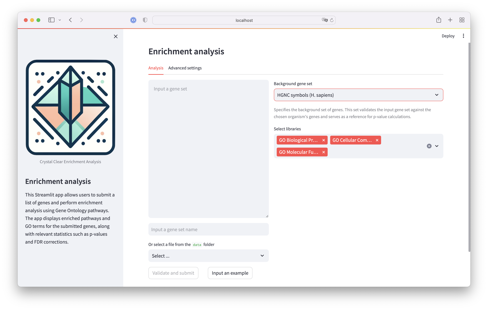
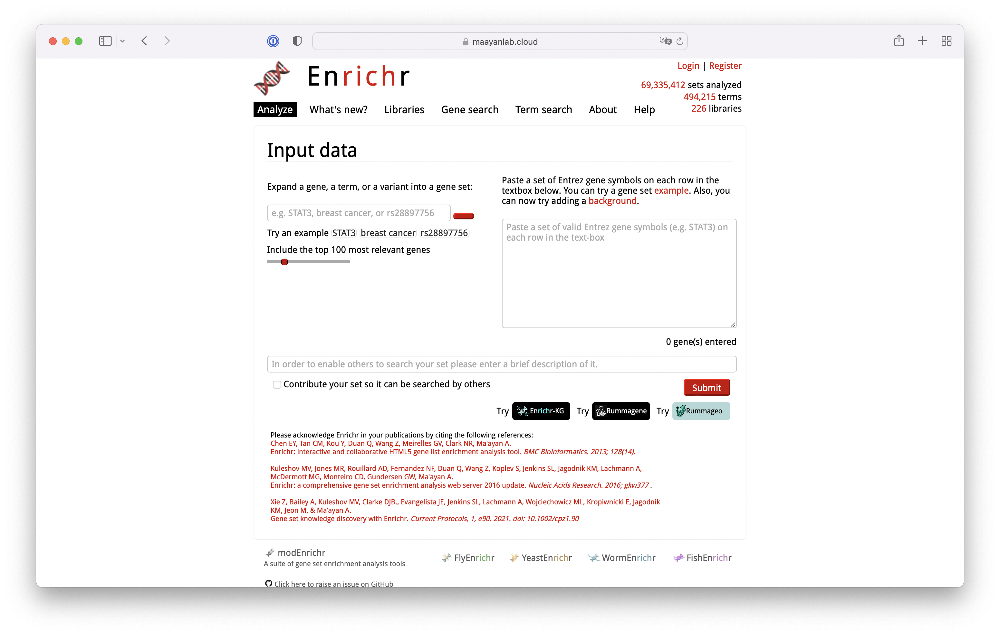
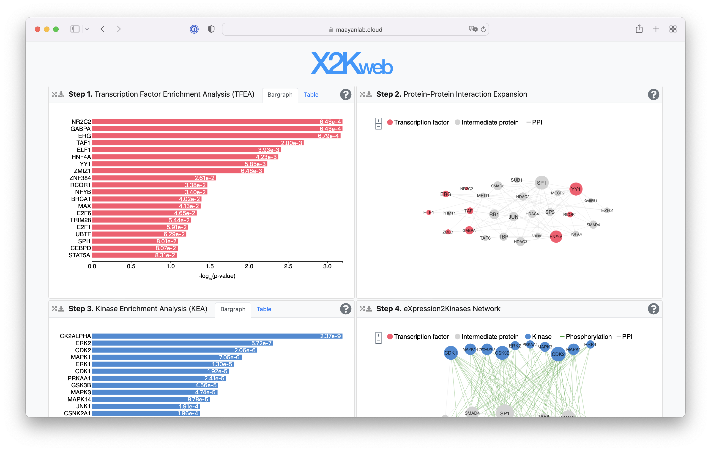
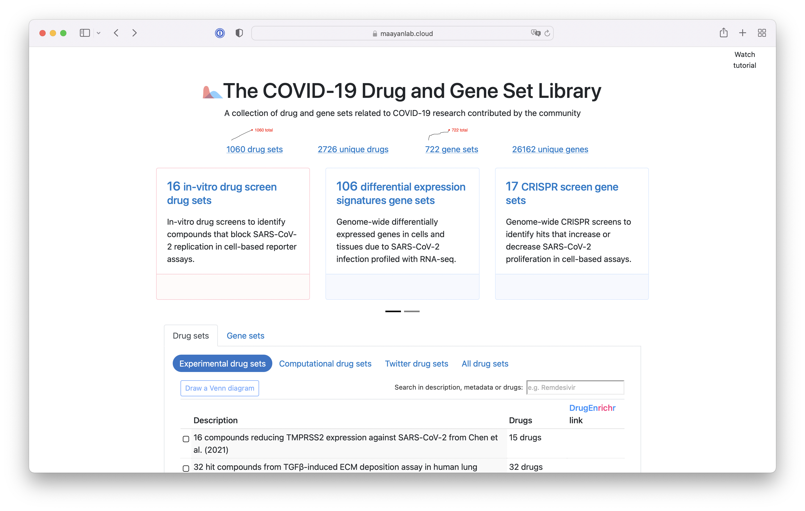
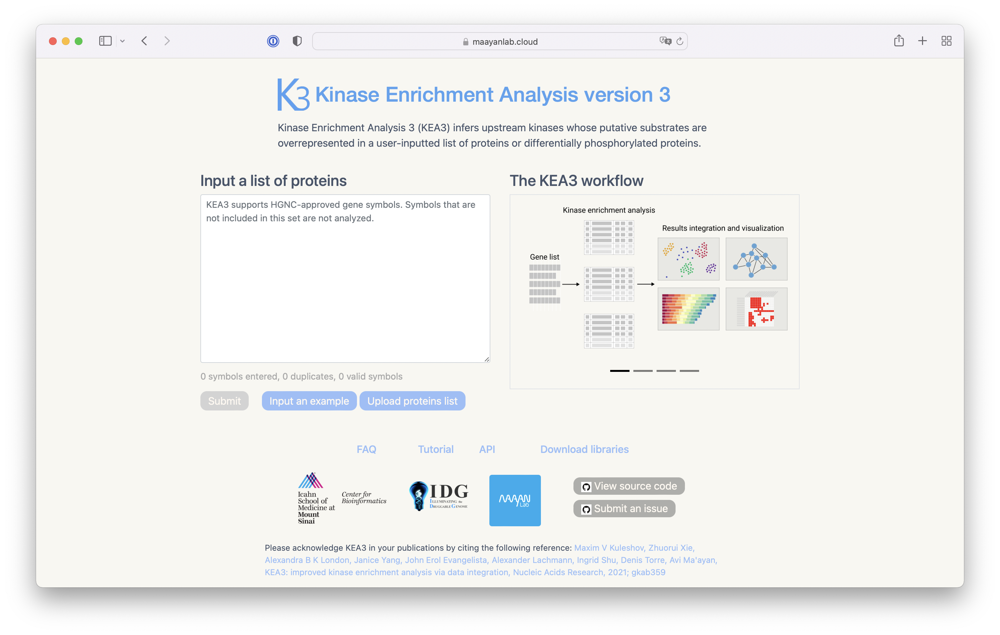
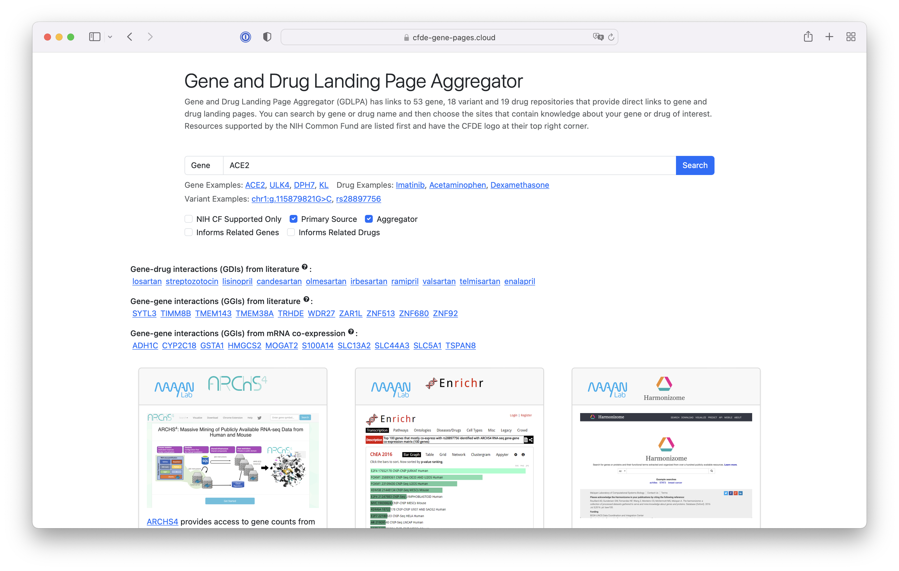
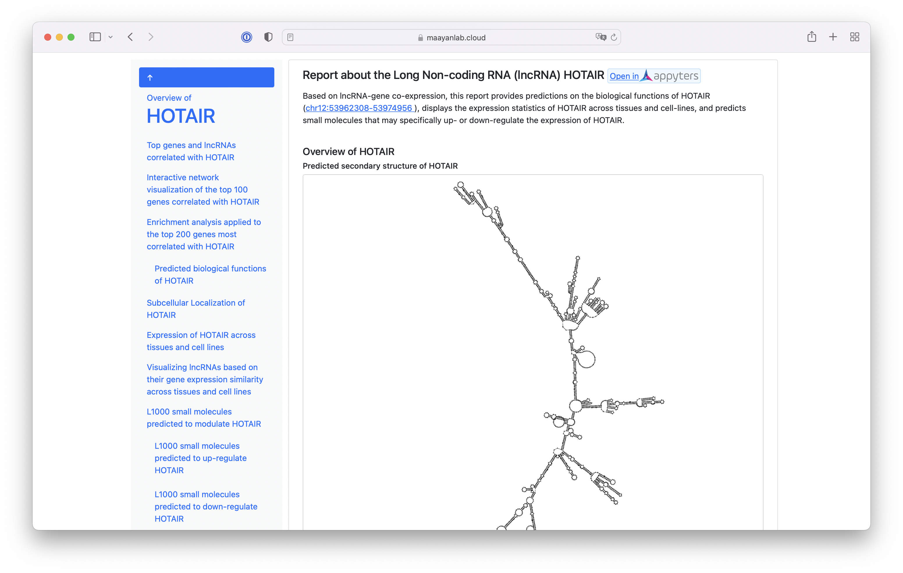

Hi there!

I'm Maxim Kuleshov, a Senior Bioinformatics Engineer based in New York. With a decade of experience in full-stack development and specialization in biological data analysis pipelines, I'm passionate about bridging the gap between science, engineering, and product development. My journey includes significant contributions at Mount Sinai's Department of Pharmacological Sciences, where I've developed applications like popular web service Enrichr and contributed to bioinformatics research with [over 10000 citations](https://scholar.google.com/citations?user=7FxtQP8AAAAJ&hl=en) to my work.

Feel free to reach out via [email](mailto:kuleshov.max.v+gh@gmail.com) or connect with me on [LinkedIn](https://www.linkedin.com/in/maxim-kuleshov/).

# My prjects

## 💎Crystal Clear Enrichment Analysis
[GitHub](https://github.com/maxim-k/cc_enrichment)

💎Crystal Clear Enrichment Analysis is a web app that lets users analyze gene sets easily. You need to prepare your background genes and gene set library files in specific formats and locations. The app can run either through Streamlit locally or using Docker.

For gene set submissions, the app accepts direct input of gene names or file selection from your data folder. It checks for duplicates and validates genes against a background set to ensure the analysis is accurate. The results are displayed in interactive charts and graphs, with options to export data in spreadsheet, data frame and JSON formats. All results are stored with unique filenames for easy management.

Advanced options include customization of the results display and different statistical methods for calculating p-values. Users can also upload their background gene sets and gene set libraries, making the app versatile for various enrichment analyses.

**Technologies**: Streamlit, Docker

## Enrichr
[Website](https://maayanlab.cloud/Enrichr/) | [Publication 1](https://academic.oup.com/nar/article/44/W1/W90/2499355) | [Publication 2](https://academic.oup.com/nar/article/47/W1/W183/5494743)

Enrichr is a web service for gene set enrichment analysis that helps researchers understand the functions associated with gene sets. Starting with 500 users, Enrichr grew to over 100,000 users, with the number of submissions increasing from 10,000 to 10 million annually. This tool simplifies data analysis, making it easier for biologists and data scientists to use. 

**Technologies:** Java, Tomcat, MySQL, JavaScript, D3.js, Docker

## X2K Web
[Website](https://maayanlab.cloud/X2K/) | [Publication](https://academic.oup.com/nar/article/46/W1/W171/5003452)

X2K Web infers upstream regulatory networks from gene expression data, integrating different analytical approaches to predict key regulatory elements.

**Technologies:** Java, Tomcat, JavaScript, D3.js, Docker

## The COVID-19 Drug and Gene Set Library
[Website](https://maayanlab.cloud/covid19/) | [GitHub](https://github.com/MaayanLab/x2k_web) |  [Publication](https://www.cell.com/patterns/fulltext/S2666-3899(20)30120-6)

This library serves as a central repository for drug and gene sets related to COVID-19, fostering community contributions and facilitating research.

**Technologies:** Python, Flask, JavaScript, D3.js, Docker

## KEA3
[Website](https://maayanlab.cloud/kea3/) | [GitHub](https://github.com/MaayanLab/KEA3web) | [Publication](https://academic.oup.com/nar/article/49/W1/W304/5850835)

KEA3 provides kinase enrichment analysis, allowing researchers to identify key kinases involved in signaling pathways related to their datasets.

**Technologies:** Java, Tomcat, JavaScript, D3.js, Docker

## Gene and Drug Landing Page Aggregator (GDLPA)
[Website](https://cfde-gene-pages.cloud/) | [GitHub](https://github.com/MaayanLab/cfde_gene_pages) | [Publication](https://academic.oup.com/bioinformaticsadvances/article/2/1/vbac013/6542459)

The GDLPA is a web tool that aggregates links to gene and drug landing pages from various repositories, simplifying the search process for researchers.

**Technologies:** Technologies used not specified; please insert relevant technologies.

## lncHUB2
[Website](https://maayanlab.cloud/lncHUB2/) | [GitHub](https://github.com/MaayanLab/lncHUB2) | [Publication](https://academic.oup.com/database/article/doi/10.1093/database/baad009/6582473)

lncHUB2 focuses on the functional predictions of human long non-coding RNAs, integrating co-expression correlations to provide insights into lncRNA functions.

**Technologies:** Python, Flask, JavaScript, Jupyter, D3.js, Docker
